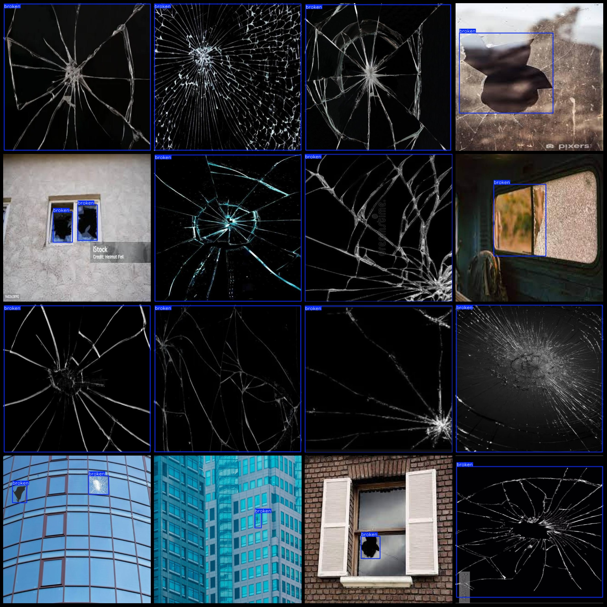
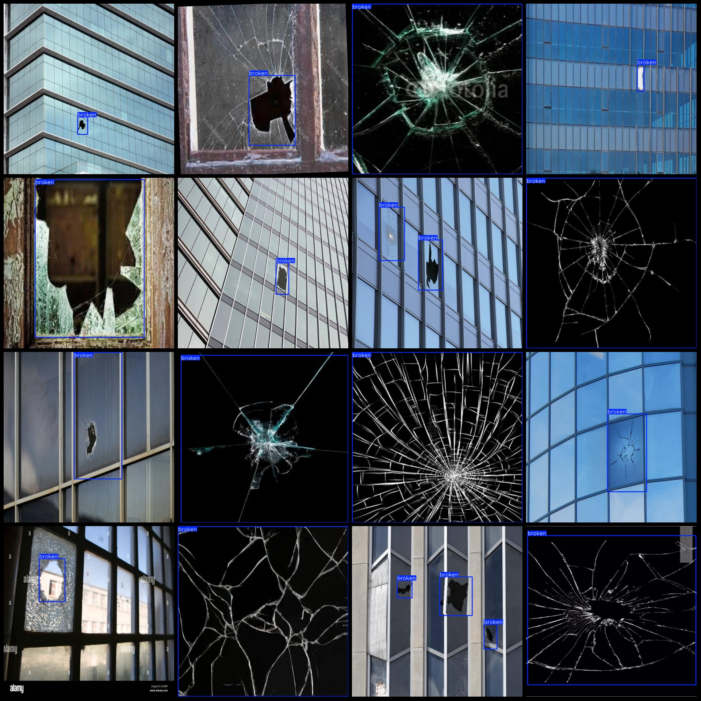

# Building Window Glass Damage Detection Dataset VOC+YOLO Format with 368 Images in 1 Category

The dataset format: Pascal VOC format + YOLO format (without the split path in a txt file, just containing jpeg images and corresponding VOC format xml files and YOLO format txt files).
Number of images (jpg file counts): 368
Number of annotations (xml file counts): 368
Number of annotations (txt file counts): 368
Number of annotation categories: 1
Annotation category name: ["broken"]
Number of bounding box instances per category:
- broken = 457
Total bounding box instances: 457
Image resolution: 640x640
Annotation tool used: labelImg
Annotation rules: Drawing bounding boxes for each category
Important note: No specific instructions provided.
Special declaration: This dataset does not guarantee the accuracy of the trained models or weights files.
Image previews:
Annotation examples:

## Image

Here is a pay link on Stripe ( https://buy.stripe.com/3cs8yP7sY87d0vu9AB ). Please contact me lonlonago@foxmail.com after funding $89, and I will send you a complete data files , thank you!

